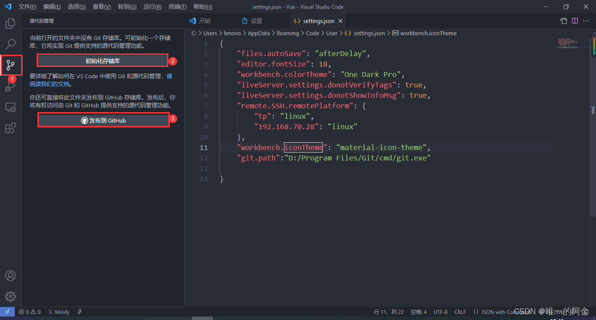

# 基本准备
## Vscode环境准备

Pycharm 专业版收费，社区版又不能开发Web，因此，选用免费、开源、轻量、便捷的Vscode。  
在安装Vscode、Python等软件后，首先打开Vscode的“终端--新建终端”。  

1. 终端操作  
    ```
    终端常用命令
    mkdir 文件夹名称    #创建文件夹
    cd 文件夹名称       #转到创建的文件夹
    此外：  
    cd ..              #跳转到上一级文件夹
    clear              #清除屏幕
    ```

2. 生成虚拟环境  
    ```  
    使用虚拟环境安装依赖
    python -m venv env      #生成虚拟环境  
    env\scripts\activate    #激活虚拟环境  
    ```  
        
3. 安装包  
    `pip install XXX`
    `pip list  #查看安装列表`

## 设置Vscode git

1. 下载并安装git  
    [git官网](https://git-scm.com/)  

2. 配置git  
        

    在输入框中输入 git.path ，打开 settings.json 文件
      

    在 settings.json 文件中，添加 git 的安装路径  
       

    然后关闭 VScode ，再次打开，过几秒钟后，点击左侧的第3个图标，也就是下图的第一个地方，发现第2和第3个地方变成了可点击状态，不是暗色的，表明git环境配置成功。  
      

## 使用Mkdocs生成学习笔记

1. 安装Mkdocs  
    
        pip install mkdocs
        mkdocs new my-project
        mkdocs build  #创建文档

        # MkDocs 包含了一个内建的服务器，可以在本地预览当前文档。在项目文件夹下打开命令提示符，执行mkdocs serve命令就可以启动内建服务器
        mkdocs serve  #启动服务器
        执行成功后，在浏览器打开 http://127.0.0.1:8000/，就可以看到页面的样子啦！
    
        #使用“Ctrl+C”可以关闭服务器  

2. 使用git将笔记推送到github
    使用ctrl+shift+P并输入git,选择“初始化存储库”  
    
      
    点击“New”

    
    点击“Creat repository”

    
    按照提示操作，命令意义如下：[Git远程操作命令](https://www.ruanyifeng.com/blog/2014/06/git_remote.html)

    Vscode中的git使用方法：[Vscode中的git使用方法](https://zhuanlan.zhihu.com/p/276376558)

3. 在Gitpage部署  
        
        mkdocs gh-deploy
     


